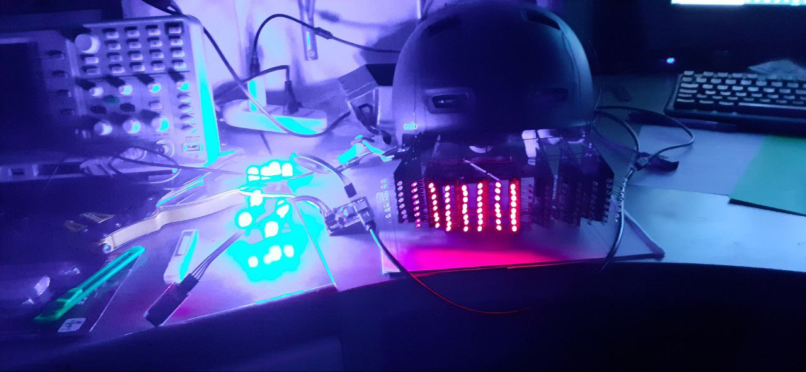

# Project Overview

This project consists of two interconnected boards using the I2C protocol. The main board, equipped with a PIC microcontroller, controls RGB LEDs (used in the mask project for the ears) and a series of MCP23017 IO extenders for the screen positioned in front of the eyes.
 
 
 
 

Additionally, a 24LC256 EEPROM is included to store phrases to be displayed, which would otherwise be too short due to memory limitations.

 

## Programming and Interfaces

The board is programmed using a PicKit via an ICSP connector and can interface with RS485 networks or via an HC-06 module (Bluetooth).
  
 

## Android App Integration

The repository also includes a simple Android project that allows the board to be controlled via a smartphone. Through the app, users can:
- Display custom text on the screen
- Change the status of the RGB LEDs

[helmet](https://www.facebook.com/100001224670164/videos/a.159338040783684/2948037965246997?locale=it_IT)

 
